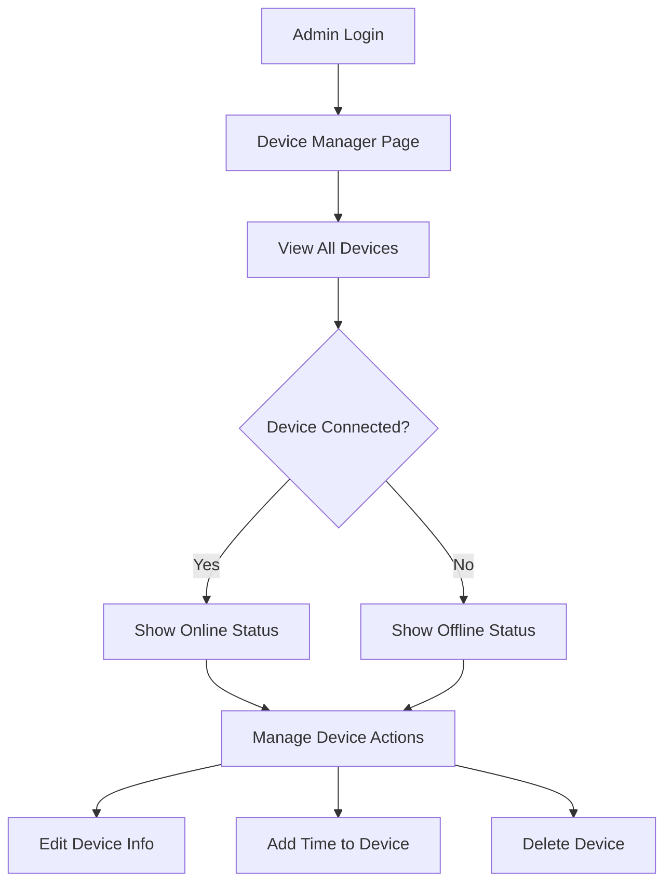

## 1. Product Overview

This refactoring project aims to simplify the device manager by removing the manual "Connected Devices (DNSMasq)" card and implementing automatic device saving functionality. When devices connect to the network, they will be automatically saved to the database without requiring manual intervention.

The goal is to streamline device management by eliminating redundant UI elements and making the system more user-friendly through automation.

## 2. Core Features

### 2.1 User Roles

| Role | Registration Method | Core Permissions |
|------|---------------------|------------------|
| Admin | Password authentication | Full device management, view all devices, edit/delete devices |
| System | Automatic | Auto-save connected devices, update device information |

### 2.2 Feature Module

The device manager refactoring consists of the following main changes:

1. **Device Manager Page**: Streamlined interface with automatic device detection and saving
2. **Auto-save System**: Background process that monitors DHCP leases and saves new devices
3. **Device Database**: Centralized storage for all device information with automatic updates

### 2.3 Page Details

| Page Name | Module Name | Feature description |
|-----------|-------------|---------------------|
| Device Manager | Device List | Display all saved devices with connection status, IP, MAC, and hostname information |
| Device Manager | Auto-save System | Automatically detect new devices from DHCP leases and save to database with "Auto-detected" note |
| Device Manager | Device Actions | Allow manual device management (edit hostname/notes, delete device, add time) |
| Device Manager | Connection Status | Real-time indicator showing which devices are currently connected vs. saved historical devices |

## 3. Core Process

### Automatic Device Detection Flow

1. **Device Connection**: When a device connects to the WiFi network, it obtains an IP address via DHCP
2. **DHCP Lease Detection**: The system monitors `/tmp/dhcp.leases` file for new lease entries
3. **Device Information Extraction**: Extract MAC address, IP address, and hostname from the lease
4. **Database Check**: Verify if device already exists in the devices table
5. **Auto-save**: If new device, automatically insert into database with "Auto-detected" note
6. **Status Update**: If existing device, update IP address and timestamp

### Admin User Flow

## 4. User Interface Design

### 4.1 Design Style

- **Primary Color**: #2563eb (Blue) for active elements and headers
- **Secondary Color**: #64748b (Gray) for secondary text and labels
- **Success Color**: #22c55e (Green) for online/connected status
- **Danger Color**: #ef4444 (Red) for delete actions and offline status
- **Layout**: Card-based design with clean spacing and modern typography
- **Buttons**: Rounded corners with hover effects, primary actions in blue
- **Status Indicators**: Color-coded badges for online/offline status

### 4.2 Page Design Overview

| Page Name | Module Name | UI Elements |
|-----------|-------------|-------------|
| Device Manager | Header Section | Page title "Device Manager" with device count summary |
| Device Manager | Device Table | Clean table with columns: Hostname, IP, MAC, Status, Actions |
| Device Manager | Status Column | Green "Online" badge for connected devices, gray "Offline" for saved devices |
| Device Manager | Actions Column | Edit, Delete, and Add Time buttons with appropriate styling |
| Device Manager | Auto-save Indicator | Subtle notification when new devices are automatically saved |

### 4.3 Responsiveness

- **Desktop-first**: Primary design optimized for desktop admin interface
- **Mobile-adaptive**: Responsive table with horizontal scrolling on smaller screens
- **Touch optimization**: Larger touch targets for mobile devices

## 5. Technical Requirements

### 5.1 Backend Changes

- Remove the manual "Connected Devices (DNSMasq)" card from the device manager page
- Enhance the existing auto-save functionality to be the primary device detection method
- Maintain the current DHCP lease monitoring system in `/tmp/dhcp.leases`
- Preserve all existing device management actions (edit, delete, add time)

### 5.2 Database Schema

The existing `devices` table structure remains unchanged:
- `mac` (TEXT PRIMARY KEY) - Device MAC address
- `ip` (TEXT) - Current IP address  
- `hostname` (TEXT) - Device hostname
- `notes` (TEXT) - Additional notes (auto-detected devices get "Auto-detected")
- `created_at` (INTEGER) - Creation timestamp
- `updated_at` (INTEGER) - Last update timestamp

### 5.3 Auto-save Logic

The system should continue using the existing auto-save mechanism:
1. Parse DHCP lease file entries
2. Extract MAC, IP, and hostname information
3. Check for existing device in database
4. Insert new device with "Auto-detected" note if not found
5. Update IP address for existing devices when changed

## 6. Success Criteria

- ✅ Manual "Connected Devices (DNSMasq)" card removed from UI
- ✅ Automatic device saving works seamlessly for all new connections
- ✅ Existing device management functionality preserved
- ✅ No disruption to current user workflows
- ✅ Performance maintained with automatic background processing
- ✅ Clear visual distinction between online and offline devices